<picture>
  <source media="(prefers-color-scheme: dark)" srcset="dark.svg">
  <source media="(prefers-color-scheme: light)" srcset="light.svg">
  
</picture>

 

 

## Sobre

Co-founder da **[DevCoder Systems](https://devcodersystems.tech)**, agência de desenvolvimento web e sistemas em Angatuba, SP. Construo sites e sistemas sob medida para negócios locais e regionais — agronegócio, clínicas, formaturas, comércio e mais.

Estudante do 3º ano de Desenvolvimento de Sistemas na ETEC Prof. Edson Galvão.

## Stack

## GitHub stats

 

  Construído por <a href="https://devcodersystems.tech">DevCoder Systems</a>

